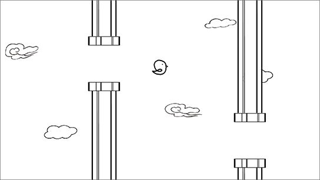

# Flappy-Bird-Lite-Tkinter

Simple Flappy Bird game created by tkinter

## Requirements

- python3.x
- PIL

## Reference

The main structure and logic are learned from [here]

## Runtime images

## Extra

- Restructure files
- Simplify some redundant codes (especially in tube.py)
- Add a Timer class to keep track of time
- Add an immortal option to the bird
- Add a pause function to pause the game

## Future Plan

- Dynamic stretching tubes
- Exaggeratively spinning tubes

[here]: https://github.com/geekcomputers/Python/tree/master/Flappy%20Bird%20-%20created%20with%20tkinter
